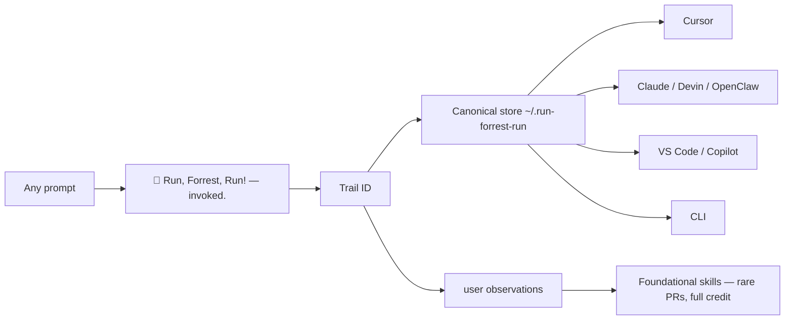

# Run, Forrest, Run!


**One command. Every IDE and CLI on this computer. One trail.**

This is the objective-runner **platform**. Not a chatbot. Not a prompt pack.
A default way to process every prompt: find the truth, keep the evidence,
stay autonomous, and let the human course-correct in one line — even from
another room.

Movie spelling. Famous line. **Run, Forrest, Run!**

```bash
chmod +x install.sh && ./install.sh
```

Or in any AI chat, paste [`PROMPT.md`](PROMPT.md).

Or: `python3 -m runforrestrun --install`

Reload the IDE. After that, any prompt is a trail.

---

## What you just installed



| Piece | What it is |
|-------|------------|
| **Voice** | Two lines. Forest icon. Funny and boardroom-safe. |
| **Trail** | One ID per prompt. Lock, truth, plan, steer, artifacts, checkpoint. |
| **Canonical** | `~/.run-forrest-run/` — every host copies from here. Delete or update once; all IDEs stay in sync. |
| **Watcher** | New IDE/CLI appears → it becomes a default automatically. |
| **Observer** | Learns *how* you work. Strips *who* you are. Writes `user_observations/`. |
| **Platform** | Not a PR per prompt. When a foundational skill shows up, it asks. You get the credit. |

---

## The two lines

Every update looks like this:

```
🌲 Run, Forrest, Run! — invoked. No warrant on 'the login bug' yet.
🌲 I'll probe it. Type anything to course-correct. Trail `a1b2c3d4e5f6` keeps the findings. I'm autonomous — step away if you want.
```

If it **cannot** run without you:

```
🌲 Run, Forrest, Run! — invoked. No warrant on 'ship to prod' yet.
🌲 I cannot run this autonomously. I need: ANTHROPIC_API_KEY in the environment. Trail `a1b2c3d4e5f6` is waiting — nothing already found is wasted.
```

Type anything. Steer is full freedom. Nothing already found is thrown away.

---

## Where things live

```
~/.run-forrest-run/
  canonical/          ← the one brain (skill, version, docs)
  runs/<id>/          ← one prompt: lock.md truth.md plan.md trail.md
                       checkpoint.json steer.jsonl events.jsonl artifacts/
  observations/       ← how you work, names and emails stripped
  platform/proposals/ ← rare foundational skills, opt-in to the world
  hosts.json          ← IDEs and CLIs we already defaulted
```

Human-readable on purpose. Agents use it. You can open it.

---

## How it evolves (without a billion PRs)

1. The observer writes abstracted notes (`user_observations/` in this repo is the public shape).
2. If a **foundational** pattern appears — how people work, not their private files — Run, Forrest, Run says so in two lines.
3. It asks. Clearly. **You get full credit.** Nothing personal ships.
4. Yes → a community skill PR. No → it stays on your machine.

That is the movement: millions of operators, a small set of shared capabilities, credits on the people who opt in.

---

## Hosts it will default

If the tool is on the machine, it gets the same canonical skill:

Cursor · VS Code / Copilot · Windsurf · Zed · Claude Code · Devin · OpenClaw ·
Codex · Aider · Goose · Gemini CLI · Amp · Continue · Agent Skills (`~/.agents`) ·
the `run-forrest-run` CLI.

New one tomorrow? `python3 -m runforrestrun --watch` — or it watches at the
start of a run.

---

## Commands

```bash
./install.sh                              # one shot
python3 -m runforrestrun --install        # detect + default
python3 -m runforrestrun --watch          # pick up newly installed IDEs
python3 -m runforrestrun --status
python3 -m runforrestrun "fix the failing test"
python3 -m runforrestrun --steer RUN_ID --message "use purple, not pink"
python3 -m runforrestrun --consent cheap-ping-not-literature --yes --credit "Your Name"
```

Kill switch: `RUN_FORREST_LOCKDOWN=1`

---

## Tenets (closed)

Atoms. Probe. Conservation. Methods (LangGraph, CrewAI, the next loop the
community ships) are gears. They change. The tenets do not.

Full constitution: [`RUN_FORREST_RUN.md`](RUN_FORREST_RUN.md).
How to build: [`HOW_TO_BUILD.md`](HOW_TO_BUILD.md).

---

## License

MIT. Fork it. Improve the platform. Keep the credits honest.
